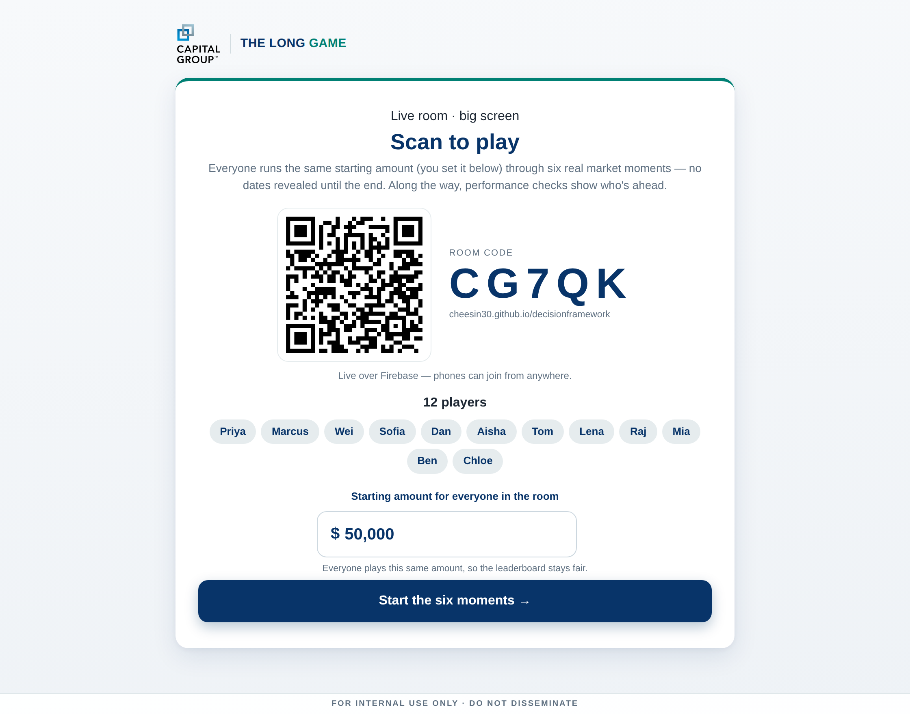
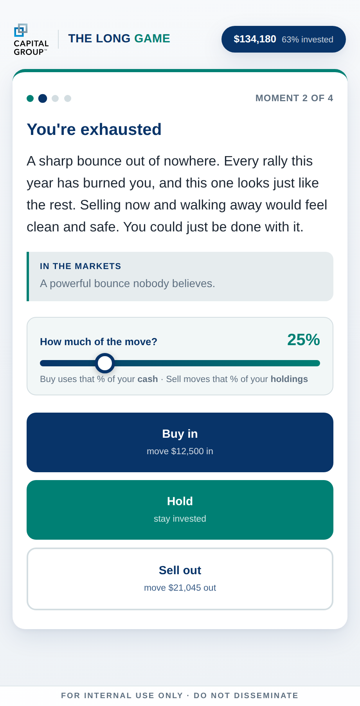
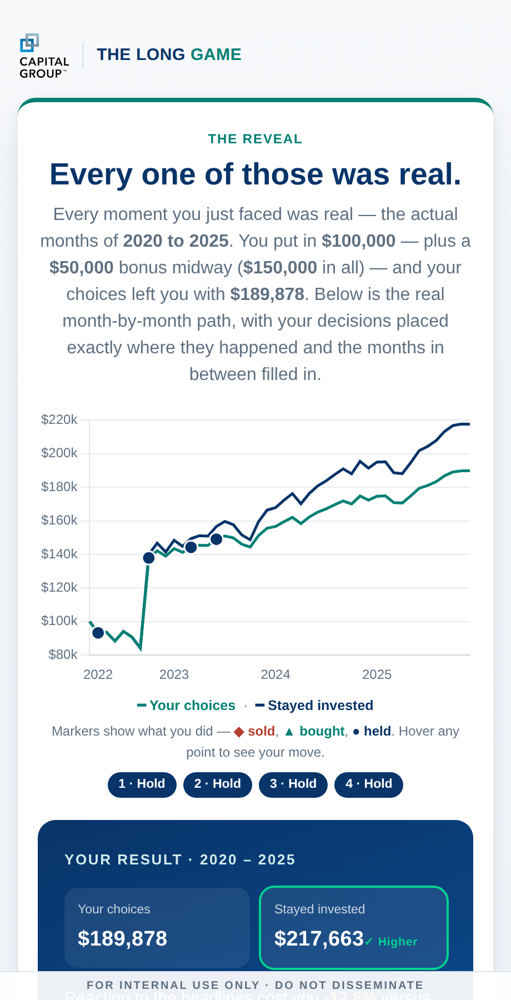
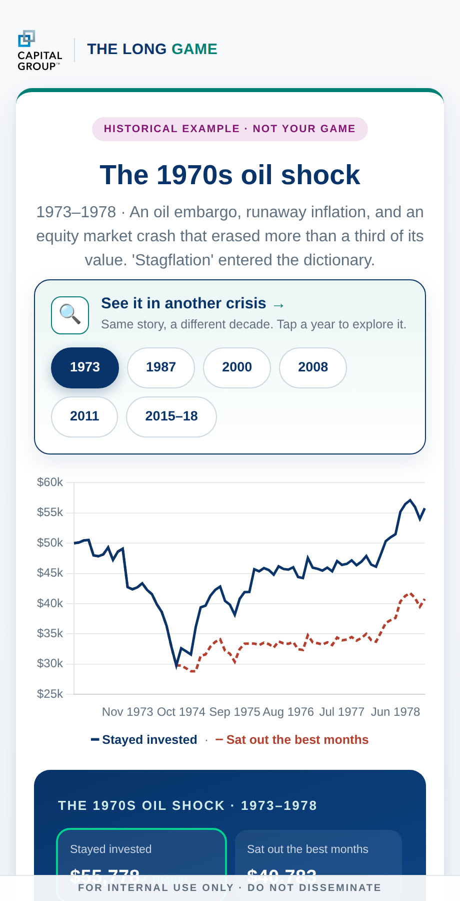

# The Long Game

> An interactive, browser-based game that lets people *feel* why **time in the market beats timing the market** — by living through real market crises, one decision at a time, without knowing which crisis they're in until the end.

**▶ Live demo:** https://cheesin30.github.io/decisionframework/

<p align="center">
  
</p>

---

## What it is

Most people *know* they shouldn't panic-sell in a crash. They do it anyway, because in the moment the fear is real and the future is invisible. **The Long Game** recreates that feeling.

You're handed a portfolio and dropped into a market moment — a crash, a mania, a panic, a war — described only by how it *feels*, never by its name or date. Each moment you choose to **Buy**, **Hold**, or **Sell**. Only at the very end is the curtain pulled back: every moment was real (the actual months of 2020–2025), and your choices are replayed against the line you'd have drawn by simply staying invested.

The gap between those two lines is the whole lesson — and because you lived it blind, it lands as something you *felt*, not something you were told.

## Three editions

| Edition | File | Who it's for |
|---|---|---|
| **Live Room** | [`long-term-game-live.html`](long-term-game-live.html) | A presenter hosts on a big screen; an audience joins from their phones by QR and plays together in real time, with a live leaderboard. 6 moments. |
| **Learning** | [`long-term-game-learning.html`](long-term-game-learning.html) | Solo, product-agnostic self-play. 4 moments. |
| **Sales** | [`long-term-game-sales.html`](long-term-game-sales.html) | Solo, advisor-led, benchmarked against a real balanced fund's monthly returns. 4 moments. |

Each is a **single self-contained HTML file** — no build step, no server, no dependencies to install. Open it in any browser and it runs.

## How it plays

<table>
  <tr>
    <td width="50%"></td>
    <td width="50%"></td>
  </tr>
  <tr>
    <td align="center"><b>Decide, blind.</b> A moment described only by its emotion. Set how much to move on a slider, then Buy, Hold, or Sell.</td>
    <td align="center"><b>The reveal.</b> Every moment was real. Your path is charted against simply staying invested — the gap is the point.</td>
  </tr>
  <tr>
    <td width="50%"></td>
    <td width="50%"></td>
  </tr>
  <tr>
    <td align="center"><b>Play it as a room.</b> Host on a big screen; the audience joins by phone and competes on a live leaderboard.</td>
    <td align="center"><b>History rhymes.</b> After your game, explore the same lesson across 1973, 1987, 2000, 2008 and more.</td>
  </tr>
</table>

## Engineering highlights

- **Real-time multiplayer, no accounts.** The Live Room syncs a whole audience through Firebase Realtime Database. Phones join by scanning a QR — no app, no login. Every game moment is shared by its **month key** rather than list position, so the host's big screen and every phone always show the same market even across game versions.
- **Survives hostile networks.** Corporate networks often strangle the streaming (SSE) connection Firebase relies on. The client detects a stalled stream and **falls back to polling** automatically, so the room still works behind restrictive firewalls — and if a phone genuinely can't reach the room, it shows a plain-English reason instead of hanging.
- **A deterministic simulation engine with a tested invariant.** Decisions are replayed through a pure simulation so the in-game running total always **exactly** equals the endpoint of the reveal chart. That invariant is asserted in an automated Playwright/Chromium test suite.
- **Real market data.** Real monthly total returns for 2020–2025 (a broad U.S. equity index + a fixed-income aggregate), plus real crisis series back to 1973; the Sales edition tracks a real balanced fund's dividend-adjusted monthly net returns, validated against published annual figures.
- **Fully self-contained and offline-capable.** Chart.js, html2canvas, and an offline QR generator are all **vendored inline** — each edition is one file that runs with no network.
- **Air-gapped option.** A bundled [`live-server/`](live-server/) relay (Node, Python, C#, and PowerShell implementations) lets an organization host the whole multiplayer game on its own infrastructure, with nothing leaving the building.

## Tech stack

Vanilla JavaScript · HTML · CSS · [Chart.js](https://www.chartjs.org/) · Firebase Realtime Database (REST + SSE, with polling fallback) · Playwright/Chromium for end-to-end tests. No framework, no bundler.

## Run it locally

It's static HTML — just open a file:

```bash
# either open directly…
open long-term-game-live.html            # macOS  (use `xdg-open` on Linux)

# …or serve the folder (nicer for the Live Room's join links)
python3 -m http.server 8000
# then visit http://localhost:8000/long-term-game-live.html
```

For hosting the Live Room on your own infrastructure, see [`live-server/README.md`](live-server/README.md).

## Project structure

```
long-term-game-live.html       Live Room edition (audience multiplayer)
long-term-game-learning.html   Solo, product-agnostic
long-term-game-sales.html      Solo, benchmarked to a real balanced fund
live-server/                   Self-hostable relay (Node · Python · C# · PowerShell)
consultant-materials/          Presenter walkthrough deck + FAQ one-pager
docs/                          How-to guide, handover guide, data & compliance checklist
archive/                       Earlier prototype iterations, kept for history
assets/                        Screenshots used in this README
```

## A note on the data

The market data is real and the mechanics are honest, but this is an **educational demonstration, not investment advice**. Fund and index figures intended for any real audience should be re-verified against source data first — see [`docs/VERIFICATION-CHECKLIST.md`](docs/VERIFICATION-CHECKLIST.md).
